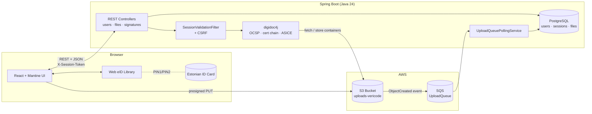

# SignIT — Estonian Digital Signature Platform

Verify and create digital signatures on Estonian signature containers (ASICE, BDOC, DDOC, EDOC) using Estonian ID cards via the Web eID protocol.

The backend is a Spring Boot service built on [digidoc4j](https://github.com/open-eid/digidoc4j) for ETSI-compliant container handling, OCSP validation, and certificate-chain checks. The frontend is a React app that drives the Estonian ID-card signing ceremony in the user's browser.

## Features

- **Verify** signatures in ASICE / BDOC / DDOC / EDOC containers — extract signers, validate certificate chains, check OCSP status
- **Sign** any file (PDF, Word, etc.) with an Estonian ID card — wraps the file in an ASICE container
- **Web eID** integration for in-browser ID-card signing ceremonies
- **Async upload** flow: presigned S3 PUT URLs + SQS event polling
- **Per-user file isolation** with session-based auth (sliding 30-minute window) and CSRF protection

## Architecture



### Upload + verify flow

1. Client requests a presigned upload URL from `GET /files/newUploadURL?filename=…`. Backend creates an `UploadSessionEntity` (10-min TTL) and returns the URL.
2. Client `PUT`s the file directly to S3.
3. S3 emits an `ObjectCreated` event to SQS. The backend's `UploadQueuePollingService` polls every 3 seconds, resolves the upload session by S3 key, and persists a `FileEntity`.
4. Client calls `POST /signatures?filename=…`; backend streams the container from S3 and validates it via digidoc4j.

### Signing flow (Estonian ID card)

1. Frontend calls `webeid.getSigningCertificate()` — user enters PIN1, browser returns the X.509 certificate.
2. `POST /signatures/prepare` with the certificate and target filename. Backend builds an ASICE container, computes the data-to-be-signed hash, and stores a `SigningSession` in memory.
3. Frontend calls `webeid.sign(hash)` — user enters PIN2, browser returns the signature bytes.
4. `POST /signatures/finalize` with the signature. Backend attaches the signature, validates the resulting container, and uploads it to S3.

## Tech stack

**Backend** — Java 24, Spring Boot 3.5, Spring Security, Spring Data JPA / Hibernate, digidoc4j 6.0.1, AWS SDK (S3, SQS), PostgreSQL, Maven, Lombok.

**Frontend** — React 19, TypeScript 5.8, Vite 7 (HTTPS via `@vitejs/plugin-basic-ssl`), Mantine 8, React Router 7, `@web-eid/web-eid-library` 2.0.

## Project structure

```
signit-backend/
└── src/main/java/com/vericode/
    ├── data/                  # JPA entities + repositories (User, File, UserSession, UploadSession)
    ├── esignatures/estonia/   # digidoc4j wrapper
    ├── services/
    │   └── uploadQueuePolling/  # SQS poller, session cleanup
    └── signit/
        ├── controllers/       # UserController, FileUploadController, SignatureController
        ├── dto/               # request/response DTOs
        ├── security/          # SecurityConfig, SessionValidationFilter, AuditLogger
        ├── signing/           # in-memory SigningSessionStore
        └── storage/           # S3Service, StorageService

signit-frontend/
└── src/
    ├── api/                   # apiClient (auth + CSRF)
    ├── backend-connection/    # one module per endpoint
    ├── components/            # LoginScreen, FileTable, SingleFileUploader, SignaturesList
    ├── contexts/              # AuthContext
    ├── hooks/                 # useAuth
    └── types/                 # SignatureInfo, VerifySignaturesResult
```

## Getting started

### Prerequisites

- Java 24 + Maven
- Node 18+
- PostgreSQL 14+ running on `localhost:5432`
- AWS account with an S3 bucket and SQS queue (S3 → SQS event notification configured)
- An Estonian ID card + reader, and the [Web eID browser extension](https://web-eid.eu/) — required for signing flows

### Configure

Create the database:

```bash
createdb uploads
```

Set backend config in `signit-backend/src/main/resources/application.properties` (or via env vars / Spring profiles):

```properties
spring.datasource.url=jdbc:postgresql://localhost:5432/uploads
spring.datasource.username=<your-db-user>
spring.datasource.password=<your-db-password>

aws.accessKeyId=<your-aws-key>
aws.secretKey=<your-aws-secret>
aws.region=eu-north-1
aws.s3.bucket=<your-bucket>
aws.sqs.UploadQueue.url=<your-sqs-queue-url>
```

> **Note:** never commit real AWS credentials. Prefer environment variables or AWS profile credentials in production.

### Run

Backend (port `8080`):

```bash
cd signit-backend
mvn spring-boot:run
```

Frontend (port `5173`, HTTPS — required by Web eID):

```bash
cd signit-frontend
npm install
npm run dev
```

Open `https://localhost:5173` and accept the self-signed certificate warning.

## API

| Method | Path | Purpose |
| --- | --- | --- |
| `POST` | `/users/register` | Register (email + password, BCrypt-hashed) |
| `POST` | `/users/login` | Returns a 32-byte session token |
| `GET`  | `/files/` | List the current user's files |
| `GET`  | `/files/newUploadURL?filename=…` | Presigned S3 PUT URL + upload-session id |
| `GET`  | `/files/{filename}` | Download a file |
| `POST` | `/signatures?filename=…` | Verify a container; returns `VerifySignaturesResult` |
| `POST` | `/signatures/prepare` | Begin signing — submit cert, receive hash |
| `POST` | `/signatures/finalize` | Complete signing — submit signature bytes |

All authenticated endpoints require `X-Session-Token` and a CSRF cookie/header pair.

## License

TBD.
